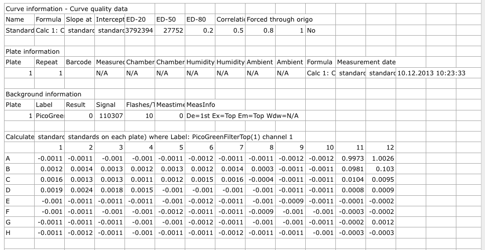
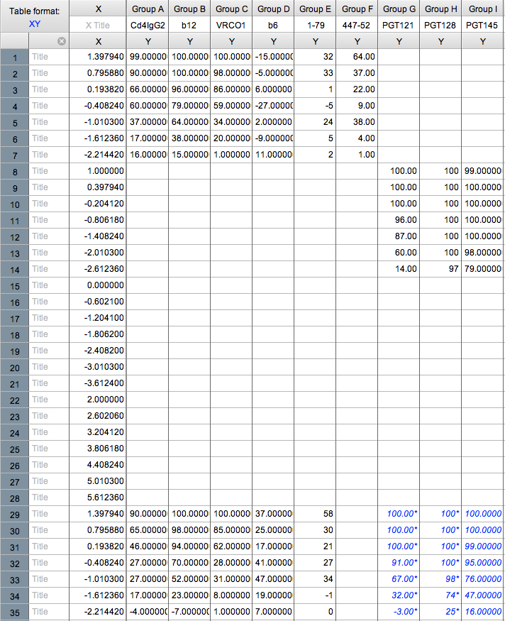
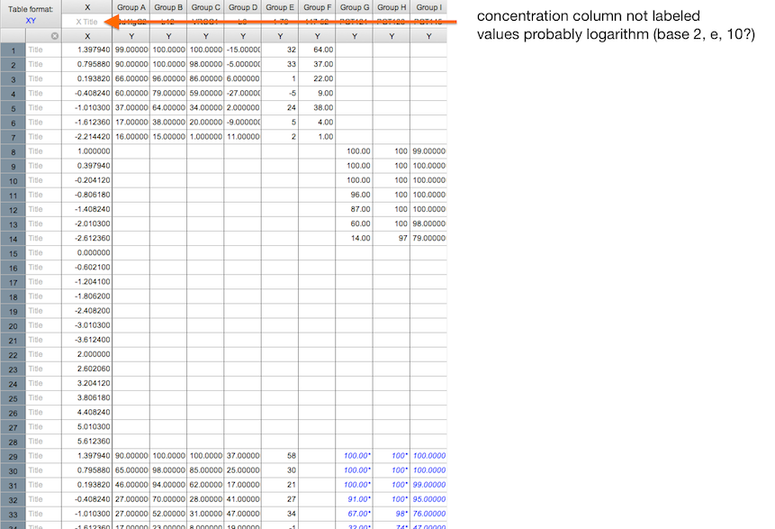
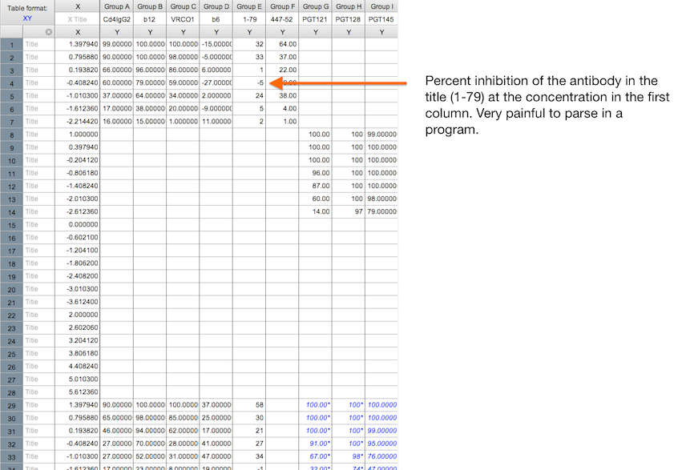
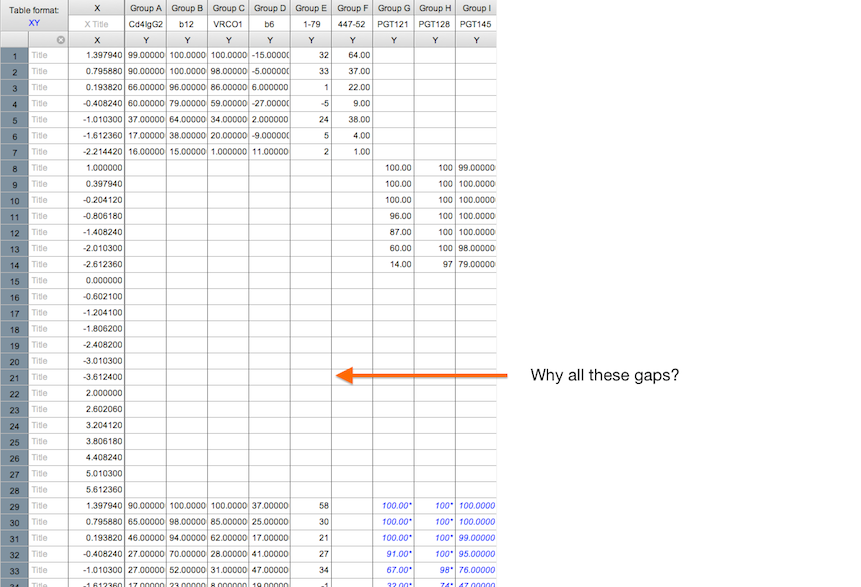
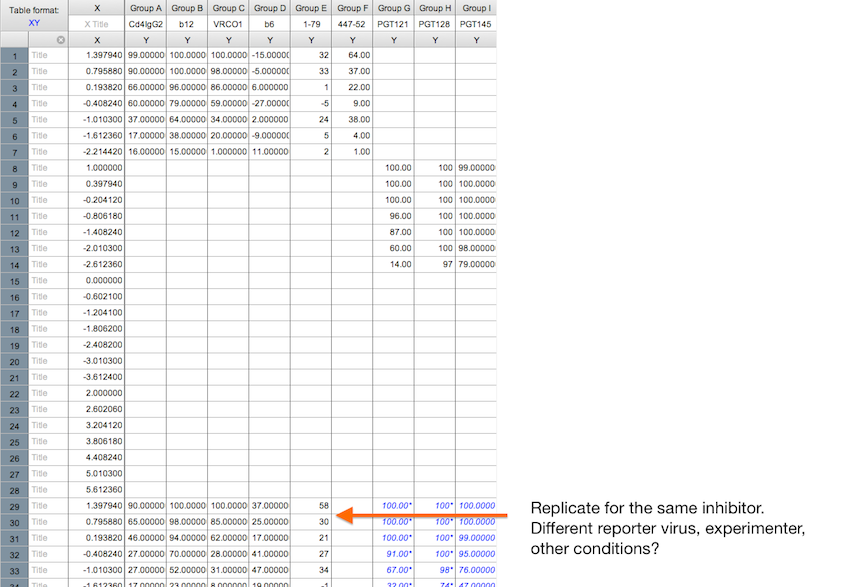
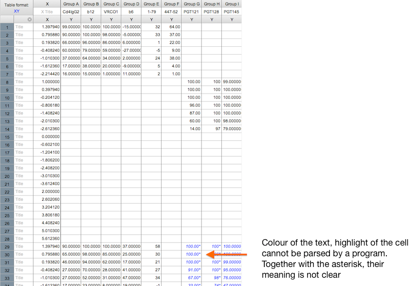

## Introduction

These slides are an adaptation of
[How to share data with a statistician](https://github.com/jtleek/datasharing)
by Jeff Leek (Johns Hopkins Bloomberg School of Public Health).

Code available on [GitHub](https://github.com/ozagordi/DataSharingPolicy)

---

## Why prescribe how to share data

#### Chiefly, because it takes more time to make sense of messy data.
***
Moreover:

1. Reduces errors and iterations (and more iterations means more time)
2. Improves reproducibility (should your analysis be questioned)
3. Helps communicating

--- &vcenter

## ..and above all

### It makes the life of the statistician much easier

---

## What you should deliver and why

1. The raw data: because it's the most trustable source.
2. A tidy data set: because it is directly processable, more on this later.
3. A code book describing each variable and its values in the tidy data set:
   it reduces errors, helps understanding, enforces reproducibility.
4. An _explicit_ and _exact_ recipe you used to go from 1 -> 2,3.

Raw data are often messy, we can't do much for them. But when we derive other
data from them we can try to make it in a tidy way.

---

## The raw data

Examples:

1. FACS output (the `.fcs` file, before using Flowjo or anything else).
2. The `.csv` or `.txt` file from the plate reader (*before* loading into Excel).
3. Microscopy `.tiff` images.
4. NGS sequences in `.fastq` format

---

## Example of raw data: file from the plate reader

As we will see, this is an example of _messy_ data.



---

## Raw means:

1. No software analysis
2. No manipulation/removal of data
3. Data were not summarised

If manipulated data is reported as raw, the statistician has to perform an
autopsy to find out what went wrong.

Autopsies are

> as fun as being hit by a (large) truck, with the downside of
> not being a fast process.

> (adapted)

---

## Tidy data set: why

Tidy data are easy to clean and analyse.

There is no need to reinvent the wheel for each new dataset.

> The development of tidy data has been driven by my struggles working with
> real-world datasets, which are often organised in bizarre ways. I have spent
> countless hours struggling to get these datasets organised in a way that
> makes data analysis possible, let alone easy.

> (Hadley Wickham)

#### Tidy datasets are not _pretty_ datasets. They are not meant to be visualised.

--- 

## Tidy dataset

A tidy dataset follows three fundamental principles:

1. Measured variables in the columns
2. Single observations of the variables in the rows
3. Different tables for different types of variables

On point 3: **no** Excel Worksheets and use unique identifiers to link
different tables.

--- &twocol w1:50% w2:50%

## Toy example: patient features

The `id` column identifies the patient and will be used to link with
the next tables (first column is row number).

*** left

#### Messy

```
##   id         dob male female
## 1 25  1979-01-16  yes       
## 2 64 20 sep 1984           y
```


Variables are listed in the columns rather than in the row. Dates and sex are
reported inconsistently.

*** right

#### Tidy

```
##   id date_of_birth sex
## 1 25    1979-01-16   M
## 2 64    1984-09-20   F
```


Dates are reported in a consistent format `YYYY-MM-YY`, sex is now a variable
(reported in the column) and reported consistently (initial, capitalised).

--- &twocol w1:50% w2:50%

## Toy example: virology diagnosis
This table reports results of some virology tests. The `id` column identifies
the patient so it can be used to link the previous table.

*** left

#### Messy

```
##   id  HIV   HCV
## 1 25 3100 45000
## 2 64    0 85000
```

The analysts would need to adapt their tool if, say, another test were added.

*** right

#### Tidy

```
##   id test viral_load
## 1 25  HIV       3100
## 2 25  HCV      45000
## 3 64  HIV          0
## 4 64  HCV      85000
```

Easier to parse and analyse.

_parse: analyse (a string or text) into logical syntactic components_ (Oxford
Dictionary)

---

## Excerpt of `JRCSF all.pzf`



---

## Excerpt of `JRCSF all.pzf`



---

## Excerpt of `JRCSF all.pzf`



---

## Excerpt of `JRCSF all.pzf`



---

## Excerpt of `JRCSF all.pzf`



---

## Excerpt of `JRCSF all.pzf`



---

## Tidy up!

Please, remove the space from the file name: `JRCSF all.pzf` becomes
`JRCSFall.pzf` or `JRCSF_all.pzf`. Statistician often use linux for data
analysis and there empty spaces mark the beginning of a new command.

Then, applying the principles of tidy data, one has

```
##   inhibitor assay_n log10_conc inhibition_percent other_info
## 1   Cd4IgG2       1     1.3979                 99       <NA>
## 2   Cd4IgG2       1     0.7959                 90       <NA>
## 3   Cd4IgG2       1     0.1938                 66       <NA>
```

`...`

```
##     inhibitor assay_n log10_conc inhibition_percent other_info
## 117    PGT145       2     -1.010                 76       star
## 118    PGT145       2     -1.612                 47       star
## 119    PGT145       2     -2.214                 16       star
```


---

## Other resources to share: the code book

The code book contains a more detailed description of what is in the tidy
dataset.

It should include 

- information about the measured/reported variables (_e.g._ units)
- whether and how measurements were summarised
- information about the experimental design (_e.g._ study design, instrument
  used, experimenter).
  
#### This will be an invaluable resource for writing the paper later!

--- 

## How to code variables

Generally speaking, variables can be:

1. continuous (weight, speed, fluorescence)
2. ordinal (discrete, but quantitative: low, medium, high)
3. categorical (no order relation given: male/female, vaccinated/non vaccinated)
4. missing (only when you don't know what happened, code with `NA`)
5. censored (missing, but you know more or less why, `NA` and set an 
   additional column `censored` to `TRUE`)

Do not use anything that would not be kept in a simple text.

--- 

## Reproducibility

One reason why statisticians prefer to write programs/scripts to analyse data
is that a set of written instructions can be reproduced exactly, unlike a set
of mouse clicks.

If you don't know a programming language and you need to request/describe an
analysis, you can use pseudocode: a detailed cooking recipe.

1. Take the file for sample A, analyse it with the program X and save column Y
2. Repeat for samples B, C, D
3. Plot mean and standard deviation (or median, or boxplot) as a function of
   the property Z of the sample that is listed in file W.

[More on reproducibility](http://www.sciencemag.org/content/334/6060/1226)

--- &vcenter
## 


